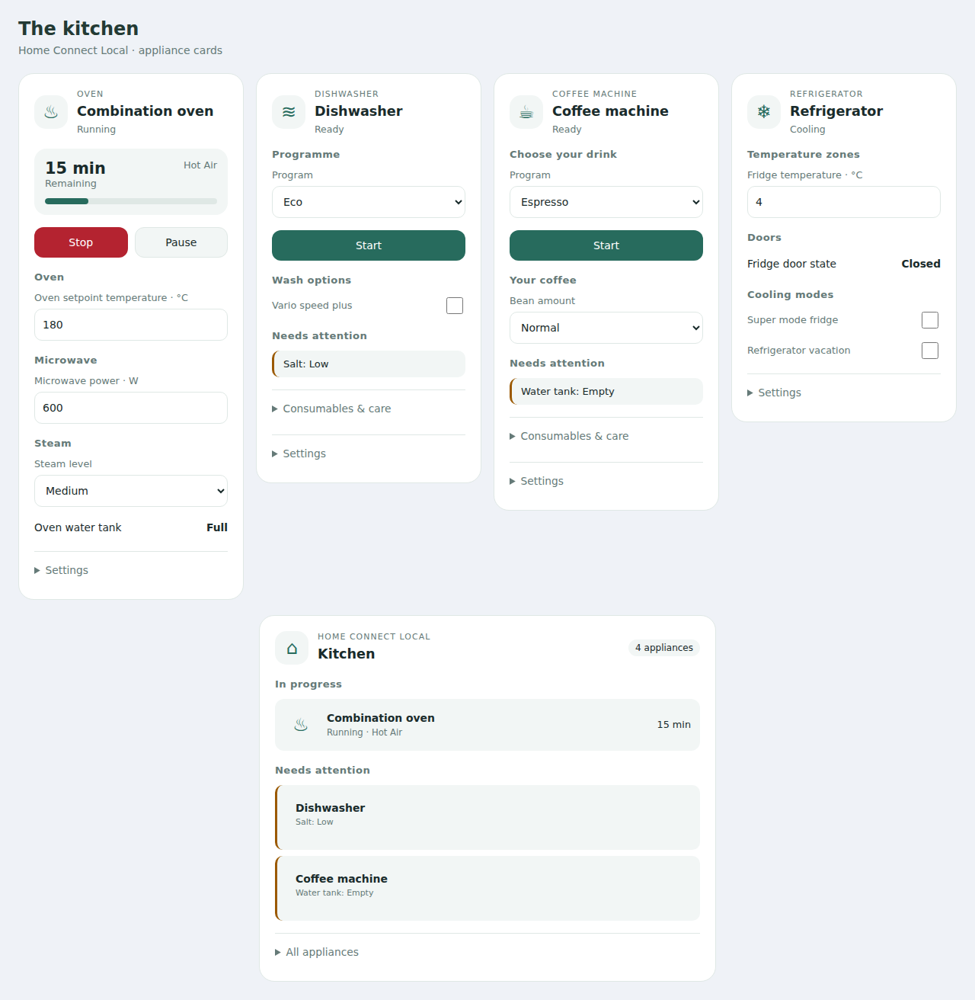

# Appliance Panel Cards

Dedicated Home Assistant dashboard cards for **Home Connect Local**. One download
includes oven, dishwasher, coffee-machine, refrigerator and kitchen overview cards.
No companion integration is required. Cloud Home Connect and staged cooking presets
are outside this release.



## Choose a card

| Card type | Layout |
| --- | --- |
| `custom:oven-card` | Programme, temperature, duration; optional microwave and steam modules |
| `custom:dishwasher-card` | Programme, wash options, salt/rinse aid and machine care |
| `custom:coffee-machine-card` | Drink selection, coffee preferences, water/beans/drip tray |
| `custom:refrigerator-card` | Temperature zones, doors, super modes, vacation and alarms |
| `custom:kitchen-panel-card` | Busy appliances ordered by known finish, plus attention across the kitchen |
| `custom:appliance-card` | Automatically inferred layout for other Local appliances |

All six have visual editors. The type-specific cards share discovery and action
handling, while showing their own controls. Missing capabilities are omitted;
unavailable controls show a reason. Unrecognized entities remain in **Other**.

```yaml
type: custom:oven-card
device: Dampovn
appearance: bubble
oven_modules: auto
```

`device` accepts a device ID or an unambiguous device name. IDs survive renames.
Discovery groups by the Home Assistant registry, never by a guessed name prefix.
Conflicting names produce an error rather than choosing an appliance for you.

```yaml
type: custom:dishwasher-card
device: Oppvaskmaskin
```

```yaml
type: custom:coffee-machine-card
device: Kaffemaskin
```

```yaml
type: custom:refrigerator-card
device: Kjøleskap
```

```yaml
type: custom:kitchen-panel-card
area: Kitchen
appearance: bubble
```

Use `devices: [device_id_1, device_id_2]` for an explicit overview list. Omitting
both filters discovers all Local appliances. An explicit `devices: []` selects
none. YAML can combine area and devices as an intersection; the visual editor
switches between these two selection modes.

## Oven modules

The same oven card handles a conventional oven, an oven with microwave, an oven
with steam, or an appliance with both. `oven_modules: auto` detects exposed
microwave/steam capabilities. To choose sections explicitly:

```yaml
type: custom:oven-card
device: Combination oven
oven_modules:
  - microwave
  - steam
```

Use `oven_modules: []` for standard oven controls only. Selecting a module cannot
create an entity that the integration does not expose. The verified upstream
Local release exposes oven temperatures and water-tank diagnostics; dedicated
microwave power/steam-level keys are capability extensions tested with labelled
synthetic fixtures. They appear when your Local installation exposes matching
entities. Programme options always come from the appliance's actual select entity.

## Operation and controls

Operation state drives transport: Start when ready, Pause/Stop while running,
Resume/Stop when paused, Stop during delayed start. Progress never determines
whether an appliance is running. Unknown/unavailable are distinct from off.

**Start and programme changes require confirmation by default.** Home Connect
Local can start certain programmes as soon as their selector changes, so changing
a programme uses the same guard. Set `confirm_start: false` only if you want to
skip those confirmations. Abort/Stop has no confirmation. Child lock changes are
always explicit.

Exposed remote-start/control permission that is off, unknown or unavailable
blocks starting actions and explains why. If Local does not expose these
permissions (some diagnostic entities are disabled by default), the card reports
that they cannot be verified; the appliance still enforces its own permissions.
All actions recheck availability, lifecycle, options and numeric limits when sent.
A confirmation becomes invalid if its appliance or registry changes.

Settings include delayed start when exposed. Power, child lock and other
programme options live in **Settings**. Numeric controls retain the integration's
units. Home Connect Local currently converts numeric writes to integers, so the
card rejects fractional writes rather than silently truncating them. Unknown
button/select controls use conservative programme-start guards.

The kitchen overview surfaces care problems and open doors, as well as offline
or unknown appliances. A healthy water tank showing `full` is distinct from a
full drip tray. It shows available last-update metadata for unreported appliances;
it cannot prove that a device has been physically removed.

## Card options

| Option | Default | Meaning |
| --- | --- | --- |
| `device` | Required for individual cards | Device ID or unambiguous name |
| `area` | All areas | Overview area ID or unambiguous name |
| `devices` | All matching devices | Explicit overview list |
| `title` | Appliance name / Kitchen | Heading override |
| `appearance` | `default` | `default` or `bubble` |
| `expand` | `true` | `false` makes individual cards a compact row opening details |
| `confirm_start` | `true` | Confirm commands that could start an appliance |
| `oven_modules` | `auto` | `auto`, or a list containing `microwave` and/or `steam` |

The Bubble appearance inherits shared `--bubble-*` theme variables for backgrounds,
accent, radii, icons, sub-buttons, borders and shadows. It does not require Bubble
Card. Error and attention colours remain distinct.

## Install

Install [Home Connect Local](https://github.com/chris-mc1/homeconnect_local_hass)
and configure your appliances first. The supported entity registry platform is
`homeconnect_ws`.

In HACS, add `mvheimburg/lovelace-appliance-panel` as a custom **Dashboard**
repository, then install Appliance Panel Cards. Alternatively copy
`dist/appliance-panel-card.js` to `config/www/`, and register
`/local/appliance-panel-card.js` as a JavaScript module dashboard resource.

## Development

```sh
npm ci
npx playwright install chromium
npm test
npm run lint
npm run typecheck
npm run build
```

`dist/` is committed. CI runs Chromium tests and verifies a rebuild produces no
distribution diff. A version bump merged to `main` triggers CI and a release.

Role fixtures are synthetic and derived from the Local integration's description
catalog at commit `27ee7995d722e0a339cd4946e6f127d4c302150d`; microwave/steam extensions
and legacy aliases are explicitly labelled. See `tests/fixtures/local.ts` and
`src/roles.ts`. These tests exercise registry discovery, lifecycle, units, actions,
editors and actual card DOM, with HA sockets/services stubbed. They do not validate
physical appliances or model-specific remote-start behavior.

### Language

Cards and visual editors follow Home Assistant's current language and update when
it changes. `hass.language` takes precedence over `hass.locale.language`. Bokmål
is used for `nb`, regional variants such as `nb-NO`, legacy `no`, and `nn` as a
Norwegian fallback; language codes are case-insensitive and accept underscores.
Missing or unsupported languages use English.

Card text, accessibility labels, confirmations, policy explanations, and known
control states are translated. User titles and device/entity/area names are
preserved. Integration program and option labels use Home Assistant's state
formatter when available; unknown values remain unchanged. Configuration keys,
option values, and service payloads are never translated. Static card-picker
product names remain English.
