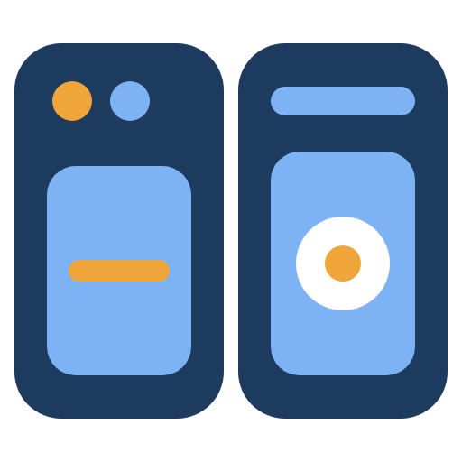
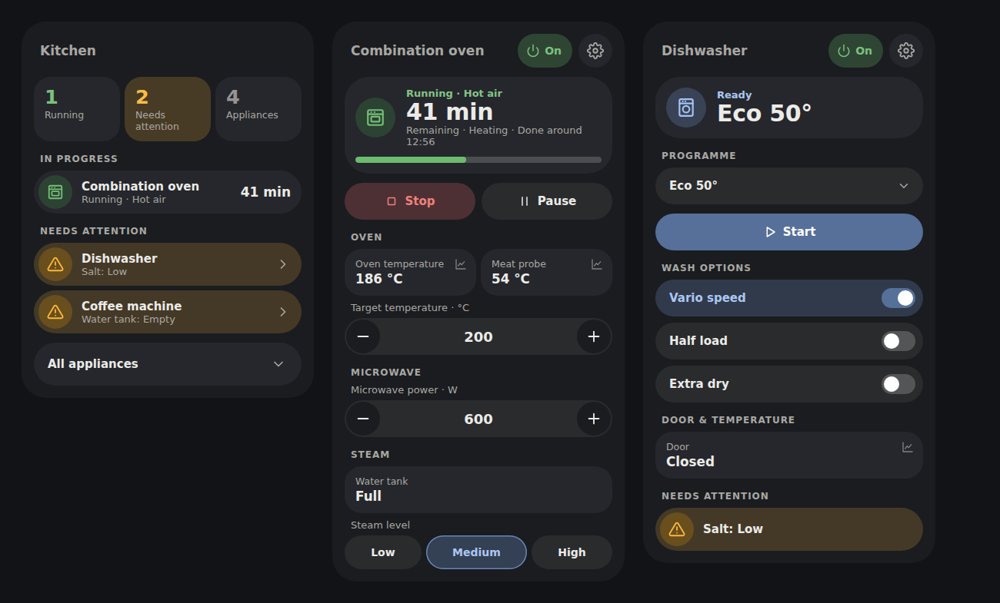
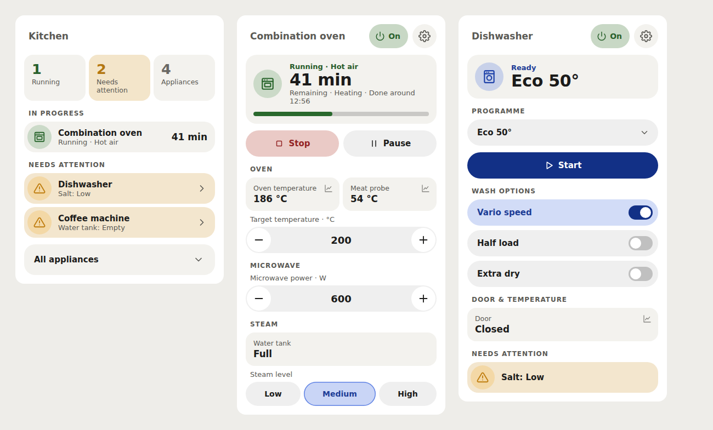
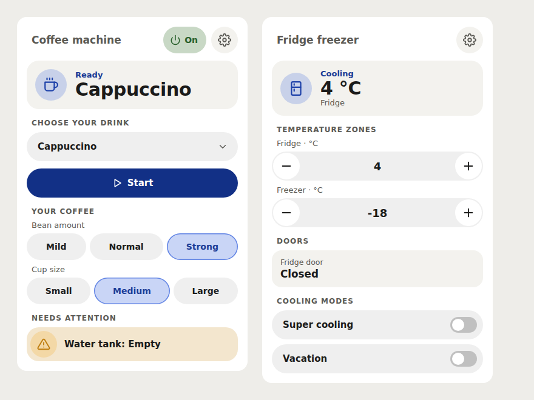
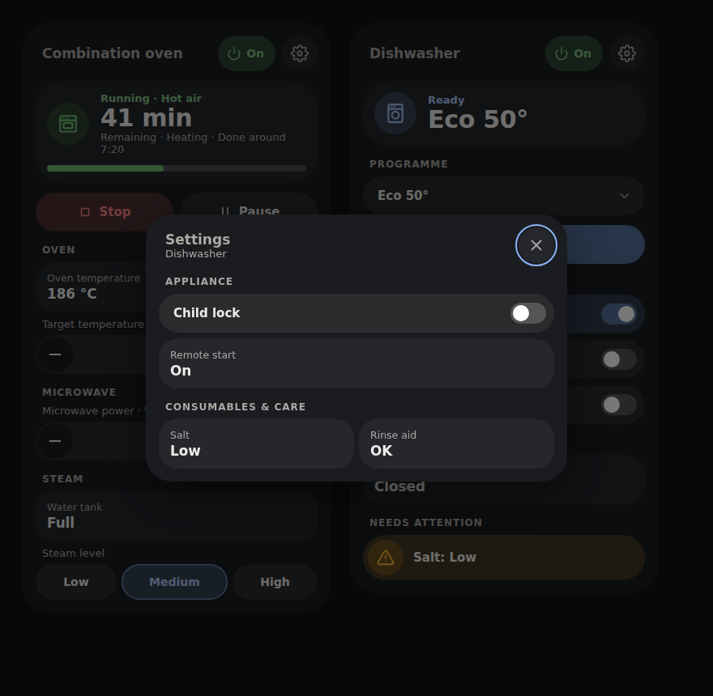
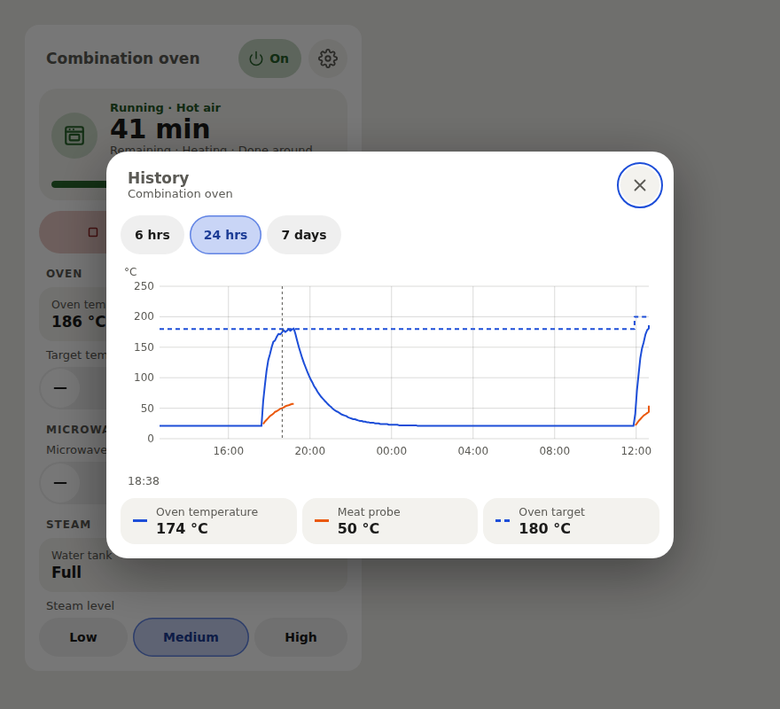

# Appliance Panel Cards

Dedicated Home Assistant dashboard cards for **Home Connect Local**. One download
includes oven, dishwasher, coffee-machine, refrigerator and kitchen overview cards.
No companion integration is required. Cloud Home Connect and staged cooking presets
are outside this release.







Screenshots use simulated Home Connect Local data.

## What each card shows

Since 0.2.0 the cards share the visual language of our other dashboard cards:
a small title line, a status **hero**, reading tiles and pill controls.

- **Title line**: the appliance name, then the **power** button and the
  **settings** cog (top right). Power toggles the exposed power switch, or
  switches a power selector between its on and standby/off options. It shows
  progress while the command is in flight, is disabled when the state is
  unavailable, and always reflects Home Assistant's state after a failure. A
  read-only power sensor is shown as a status pill.
- **Hero**: a round icon tinted by status, the status line (for example
  _Running · Hot air_), a large headline (time remaining, time until a delayed
  start, the selected programme, or the fridge temperature) and context such as
  the phase and the estimated finish time. A progress bar appears while a
  programme runs.
- **Everyday controls**: programme picker, Start/Pause/Resume/Stop, oven
  temperature and duration steppers, microwave and steam modules, wash and
  coffee options, cooling zones and modes. Short option lists are chips;
  switches are toggle pills; numbers are − / + steppers with an editable value.
- **Readings**: measured values such as the oven, meat-probe and freezer
  temperatures are tiles with a small chart mark. Tap one to open its history
  (see below).
- **Needs attention**: salt, rinse aid, water tank, doors, errors and offline
  states as tinted rows.
- **Settings (cog)**: a dialog with the controls that are not everyday tasks:
  child lock, remote-control level, delayed start, additional power controls,
  oven/refrigerator programme options, other appliances' temperature and
  duration, remote-start permission, the full consumables & care readings,
  unrecognised **Other** entities and disabled-entity hints. The values and
  service calls are the same as before; only where they are shown changed.



### Reading history

From 0.4.0 a measured reading opens a history of its appliance, drawn in the
card's own style from Home Assistant's recorder:

- **What is drawn**: the appliance's current temperatures (oven, meat probe,
  fridge/freezer zones) together with their setpoints — the oven's target
  temperature, the fridge/freezer setpoints — drawn **dashed** in the colour of
  the zone they control and labelled as targets (_Oven target_, _Fridge
  target_, _Freezer target_; Bokmål _Ovn, ønsket_, _Kjøleskap, ønsket_,
  _Fryser, ønsket_). A setpoint you renamed in Home Assistant keeps your name. A setpoint holds its value until it is changed, so it
  is drawn as steps. When the tapped reading is something else (for example a
  humidity sensor or a care countdown with a unit), it is added with its own
  **right-hand scale** in its unit.
- **Ranges**: 6 h, 24 h and 7 d. Move the pointer (or drag a finger) over the
  chart to read every value at that moment in the legend; the time is shown
  above it, following Home Assistant's 12/24-hour setting and your regional
  format.
- **Legend**: each entry opens Home Assistant's more-info dialog for that entity.
- **Gaps**: spells when a reading was unavailable (for example a meat probe that
  is not plugged in) are left as gaps rather than bridged.
- A failed request is explained in the dialog; nothing on the card changes.

A tile opens the history when it is a numeric **sensor** with a unit or state
class. These stay plain, by design, to keep the card lean: programme remaining
and elapsed time, delayed-start countdowns, progress, programme and phase names,
operation state, on/off and door states, enum sensors such as salt or water tank
levels, and timestamps. Controls stay controls: temperature steppers, chips,
selects and switches never become history buttons; their values appear in the
chart as setpoints instead.



The kitchen overview shows summary tiles (running, needing attention,
appliances), one row per running appliance with its remaining time, one
attention row per appliance listing all its issues (for example *Door: Open ·
Rinse aid: Nearly empty*, coloured by the most serious; from 0.2.1), and **All
appliances**. Selecting a row opens the appliance with the same
power and settings buttons.

## Choose a card

| Card type | Layout |
| --- | --- |
| `custom:oven-card` | Programme, temperature, duration; optional microwave and steam modules |
| `custom:dishwasher-card` | Programme, wash options, salt/rinse aid and machine care |
| `custom:coffee-machine-card` | Drink selection, coffee preferences, water/beans/drip tray |
| `custom:refrigerator-card` | Temperature zones, doors, super modes, vacation and alarms |
| `custom:kitchen-panel-card` | Busy appliances ordered by known finish, plus attention across the kitchen |
| `custom:appliance-card` | Automatically inferred layout for other Local appliances |

All six have visual editors. The type-specific cards share discovery and action
handling, while showing their own controls. Missing capabilities are omitted;
unavailable controls show a reason. Unrecognized entities remain in **Other**.

```yaml
type: custom:oven-card
device: Dampovn
appearance: bubble
oven_modules: auto
```

`device` accepts a device ID or an unambiguous device name. IDs survive renames.
Discovery groups by the Home Assistant registry, never by a guessed name prefix.
Conflicting names produce an error rather than choosing an appliance for you.

```yaml
type: custom:dishwasher-card
device: Oppvaskmaskin
```

```yaml
type: custom:coffee-machine-card
device: Kaffemaskin
```

```yaml
type: custom:refrigerator-card
device: Kjøleskap
```

```yaml
type: custom:kitchen-panel-card
area: Kitchen
appearance: bubble
```

Use `devices: [device_id_1, device_id_2]` for an explicit overview list. Omitting
both filters discovers all Local appliances. An explicit `devices: []` selects
none. YAML can combine area and devices as an intersection; the visual editor
switches between these two selection modes.

## Oven modules

The same oven card handles a conventional oven, an oven with microwave, an oven
with steam, or an appliance with both. `oven_modules: auto` detects exposed
microwave/steam capabilities. To choose sections explicitly:

```yaml
type: custom:oven-card
device: Combination oven
oven_modules:
  - microwave
  - steam
```

Use `oven_modules: []` for standard oven controls only. Selecting a module cannot
create an entity that the integration does not expose. The verified upstream
Local release exposes oven temperatures and water-tank diagnostics; dedicated
microwave power/steam-level keys are capability extensions tested with labelled
synthetic fixtures. They appear when your Local installation exposes matching
entities. Programme options always come from the appliance's actual select entity.

## Operation and controls

Operation state drives transport: Start when ready, Pause/Stop while running,
Resume/Stop when paused, Stop during delayed start. Progress never determines
whether an appliance is running. Unknown/unavailable are distinct from off.

**Start and programme changes require confirmation by default.** Home Connect
Local can start certain programmes as soon as their selector changes, so changing
a programme uses the same guard. Set `confirm_start: false` only if you want to
skip those confirmations. Abort/Stop has no confirmation. Child lock changes are
always explicit.

Exposed remote-start/control permission that is off, unknown or unavailable
blocks starting actions and explains why. If Local does not expose these
permissions (some diagnostic entities are disabled by default), the card reports
that they cannot be verified; the appliance still enforces its own permissions.
All actions recheck availability, lifecycle, options and numeric limits when sent.
A confirmation becomes invalid if its appliance or registry changes.

Power is in the title line. Child lock, delayed start (when exposed) and other
rarely used controls live behind the **settings** cog. Numeric controls retain
the integration's units. Home Connect Local currently converts numeric writes to
integers, so the card rejects fractional writes rather than silently truncating
them. Unknown button/select controls use conservative programme-start guards.

The kitchen overview surfaces care problems and open doors, as well as offline
or unknown appliances. A healthy water tank showing `full` is distinct from a
full drip tray. It shows available last-update metadata for unreported appliances;
it cannot prove that a device has been physically removed.

## Card options

| Option | Default | Meaning |
| --- | --- | --- |
| `device` | Required for individual cards | Device ID or unambiguous name |
| `area` | All areas | Overview area ID or unambiguous name |
| `devices` | All matching devices | Explicit overview list |
| `title` | Appliance name / Kitchen | Heading override |
| `appearance` | `default` | `default` or `bubble` |
| `expand` | `true` | `false` makes individual cards a compact row opening details |
| `confirm_start` | `true` | Confirm commands that could start an appliance |
| `oven_modules` | `auto` | `auto`, or a list containing `microwave` and/or `steam` |

Colours come from Home Assistant theme variables (`--success-color`,
`--warning-color`, `--orange-color`, `--error-color`, `--primary-color`,
`--disabled-text-color`), so the cards follow light and dark themes. The Bubble
appearance inherits shared `--bubble-*` theme variables for backgrounds, accent,
radii, icons, borders and shadows. It does not require Bubble Card. Error and
attention colours remain distinct.

## Install

Install [Home Connect Local](https://github.com/chris-mc1/homeconnect_local_hass)
and configure your appliances first. The supported entity registry platform is
`homeconnect_ws`.

In HACS, add `mvheimburg/lovelace-appliance-panel` as a custom **Dashboard**
repository, then install Appliance Panel Cards. Alternatively copy
`dist/appliance-panel-card.js` to `config/www/`, and register
`/local/appliance-panel-card.js` as a JavaScript module dashboard resource.

## Development

```sh
npm ci
npx playwright install chromium
npm test
npm run lint
npm run typecheck
npm run build
npm run screenshots   # regenerates docs/*.png from dist/ with simulated data
```

`dist/` is committed. CI runs Chromium tests and verifies a rebuild produces no
distribution diff. A version bump merged to `main` triggers CI and a release.

Role fixtures are synthetic and derived from the Local integration's description
catalog at commit `27ee7995d722e0a339cd4946e6f127d4c302150d`; microwave/steam extensions
and legacy aliases are explicitly labelled. See `tests/fixtures/local.ts` and
`src/roles.ts`. These tests exercise registry discovery, lifecycle, units, actions,
editors and actual card DOM, with HA sockets/services stubbed. They do not validate
physical appliances or model-specific remote-start behavior.

### Language

Cards and visual editors follow Home Assistant's current language and update when
it changes. `hass.language` takes precedence over `hass.locale.language`. Bokmål
is used for `nb`, regional variants such as `nb-NO`, legacy `no`, and `nn` as a
Norwegian fallback; language codes are case-insensitive and accept underscores.
Missing or unsupported languages use English.

Card text, accessibility labels, confirmations, policy explanations, and known
control states are translated. User titles and device/entity/area names are
preserved. Integration program and option labels use Home Assistant's state
formatter when available; unknown values remain unchanged. Configuration keys,
option values, and service payloads are never translated. Static card-picker
product names remain English.

## Color schemes

Choose **Color scheme** in the card's visual editor. The setting is per card and
works with both **Default** and **Bubble** appearance, including in-card dialogs.
Every card supplied by this package offers the same choices:

| Scheme | YAML value | Palette |
| --- | --- | --- |
| Home Assistant (default) | `home-assistant` | Follows your dashboard theme and Bubble color variables |
| Bright | `bright` | White surfaces with blue accents |
| Warm | `warm` | Ivory surfaces with warm brown accents |
| Mint | `mint` | Pale green surfaces with green accents |
| Sky | `sky` | Pale blue surfaces with blue accents |
| Lavender | `lavender` | Pale purple surfaces with purple accents |

For example, add these options to your existing card configuration:

```yaml
appearance: bubble
color_scheme: mint
```

The five light schemes stay light even on a dark dashboard and override inherited
colors only within this card. Status colors retain their meaning (green for
success, amber for warnings and red for errors). Remove `color_scheme` or choose
**Home Assistant** to follow the dashboard again. Existing configurations keep
their current appearance. Scheme names and the editor label support English and
Norwegian Bokmål; YAML values remain unchanged in either language. Static
card-picker metadata remains English because it has no Home Assistant language
context.
